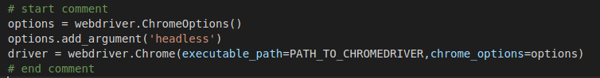
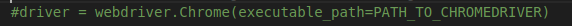

# registration
## Đăng kí lớp học HUST
## Yêu cầu
- Python3

## Sử dụng
1. Download/Clone repo
2. cd registration/
3. python3 -m venv venv
4. source venv/bin/active
5. pip install -r requirements.txt 
6. Sửa thông tin biến username và password trong file auto_register.py
7. Sửa lại path_to_chromedriver trong file auto_register.py
8. Comment đoạn code sau và uncomment đoạn code dưới nếu muốn xem quá trình chạy

9. Điền mã học phần vào biến subject
10. run command: python auto_register.py